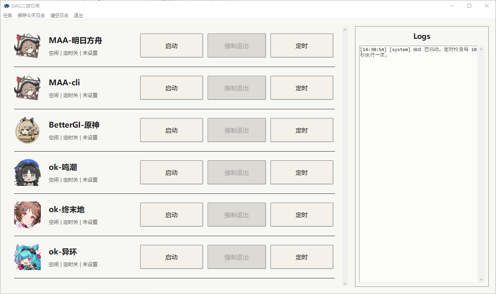

# DAG-DailyAnimeGames二游日常

本项目是一个二游日常任务 GUI 调度器。



## 启动

需要 Windows、Git 和 Python 3.12。推荐直接运行根目录入口：

```powershell
.\Run.bat
```

`Run.bat` 会检测 `.venv` 是否存在且能加载 GUI 依赖；缺失时会自动创建环境，然后启动 GUI。

## 更新已下载项目

```powershell
.\Update.bat
```

执行时会先用 `git pull --ff-only` 更新本仓库根目录，再更新当前已经下载的 submodule，跳过未安装项目。submodule 更新时会直接把每个 submodule 重置到它自己的远端分支最新版：

- `src/ok-end-field` -> `origin/master`
- `src/ok-nte` -> `origin/main`
- `src/ok-wuthering-waves` -> `origin/master`

## 关联项目

| 项目 | GitHub |
|------|--------|
| MAA | https://github.com/MaaAssistantArknights/MaaAssistantArknights |
| BetterGI | https://github.com/babalae/better-genshin-impact |
| ok-end-field | https://github.com/AliceJump/ok-end-field |
| ok-nte | https://github.com/BnanZ0/ok-nte |
| ok-wuthering-waves | https://github.com/ok-oldking/ok-wuthering-waves |
